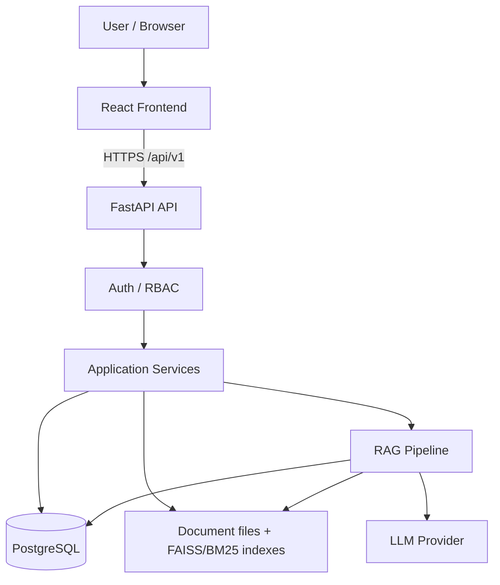
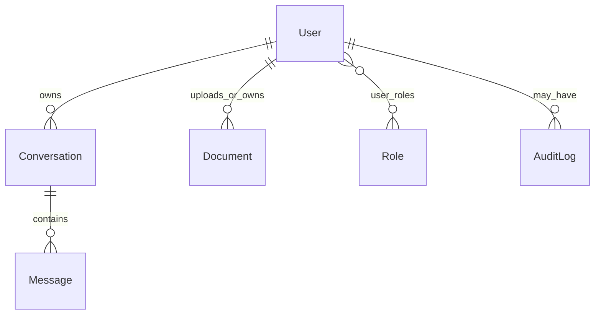

# Knowra - Project Overview

This document is the detailed reference for the **implemented** product: what it is, who it is for, how the system works end-to-end, and how the major pieces fit together.

It describes the codebase as it exists today. It does not document planned features as if they were shipped, and it does not recount development history.

| Go deeper | Document |
|-----------|----------|
| Design decisions & pipelines (concise) | [ARCHITECTURE.md](ARCHITECTURE.md) |
| Local setup & developer workflow | [DEVELOPMENT.md](DEVELOPMENT.md) |
| Production deployment | [DEPLOYMENT.md](DEPLOYMENT.md) |
| Automated tests & evaluation | [TESTING.md](TESTING.md) |
| Public introduction & quick start | [README.md](../README.md) |

---

## 1. Project overview

**Knowra** is an AI-powered internal knowledge platform. Organisations upload policy manuals, handbooks, reports, and other files; the system builds a searchable knowledge base; authenticated users ask natural-language questions and receive answers grounded in retrieved document evidence, with citations back to the source.

### Problem

Internal knowledge is usually scattered across PDFs, Word files, spreadsheets, and shared drives. Employees repeatedly ask the same policy questions. Generic chatbots that ignore access control create a risk: a user might see content they are not authorised to read.

### Why this project exists

The project demonstrates a **production-oriented, single-organisation** secure RAG (Retrieval-Augmented Generation) application: not a toy “chat with one PDF” script, but a full stack with authentication, role-based access control (RBAC), document ACLs, an ingestion pipeline, hybrid retrieval, conversations, admin tooling, analytics, and Docker-based deployment.

### What makes it different from a basic “chat with PDF” app

| Basic chat-with-PDF | This project |
|---------------------|--------------|
| One or few files, often open to anyone with the link | Multi-document knowledge base with visibility / role ACLs |
| Usually vector search only | Hybrid dense (FAISS) + sparse (BM25) retrieval, query intelligence, cross-encoder reranking |
| Soft or missing access control | Fail-closed retrieval: unauthorized sources never become evidence |
| Answer with weak provenance | Citations with excerpt, page, open-in-new-tab viewer, passage highlighting |
| Minimal product shell | Landing, register/login, dashboard, chat, documents, admin, analytics, monitoring |

### Core concept

```
Enterprise documents
  → secure knowledge base (Postgres metadata + file storage + search indexes)
  → role-aware retrieval (only authorized sources)
  → natural-language questions
  → grounded answers (LLM or rule-based fallback)
  → source citations (filename, excerpt, confidence, page)
```

### Current project scope

- **Single-organisation** deployment model (`TENANT_ID`, default `default`)
- Portfolio / demo–ready FastAPI + React application
- No claim of commercial customers or compliance certifications

---

## 2. Target users and use cases

Intended audiences (not existing customers):

| Audience | Typical need |
|----------|----------------|
| Enterprises / internal knowledge teams | Central place to ask about policies and procedures |
| HR | Publish and query leave, benefits, and handbook content |
| Finance | Restrict treasury / finance reports to finance-capable roles |
| Employees | Self-serve answers within their document access |
| Administrators | Users, uploads, monitoring, analytics |
| Compliance-sensitive organisations | Prefer systems where retrieval respects ACLs |

### Example use cases

**Employee**  
> “How many annual leave days do I receive?”  
Retrieval only uses documents that employee is allowed to read (for example public handbook sections or restricted docs that include the Employee role).

**HR**  
> “What is the parental leave policy?”  
HR can upload and update HR-oriented documents (`document:create` / `document:update`) and query the knowledge base.

**Finance**  
> “What does the treasury report say about liquidity?”  
Finance can query and read finance-visible documents but does **not** get upload permission by default.

**Admin**  
> “Which documents are currently processing?” / manage users and roles  
Admin has full platform permissions, including analytics and user management.

Access permissions change the **evidence set**. The same question asked by two roles can produce different answers (or refusals with no evidence) if their authorized document sets differ.

---

## 3. Complete feature overview

### Knowra chat

| Capability | Status |
|------------|--------|
| Natural-language Q&A over the knowledge base | Implemented (`POST /chat/ask`) |
| Grounded responses from retrieved context | Implemented |
| Citations (source, excerpt, confidence, page) | Implemented |
| Open source in a **new browser tab** | Implemented |
| Navigate to the cited PDF page | Implemented |
| Highlight the cited passage on the page | Implemented (text-layer match; progressive enhancement) |
| Conversation history (create, rename, delete, messages) | Implemented |
| Generated conversation titles after first message | Implemented (LLM with keyword fallback) |
| Suggested questions (authorized-document aware) | Implemented |

### Document management

| Capability | Status |
|------------|--------|
| Document upload | Implemented (Admin + HR by permission) |
| Multi-file upload | Implemented (frontend batch up to 10; concurrent uploads) |
| Supported formats | `.pdf`, `.txt`, `.csv`, `.json`, `.docx`, `.xlsx` |
| Upload size limit | 50 MB per file (backend validation) |
| Duplicate detection (SHA-256 checksum) | Implemented |
| Processing / searchable status | Implemented |
| In-app document viewing (PDF viewer + download) | Implemented |
| Deletion | Implemented (permission-gated; soft-delete status) |
| Visibility / access control | `public` / `restricted` / `private` + `allowed_roles` |

### User management

| Capability | Status |
|------------|--------|
| Public registration | Implemented (`POST /auth/register`) |
| Default **Employee** assignment | Always server-side |
| Admin-created users with role | Atomic create-with-role |
| Runtime role changes | Implemented |
| Enable / disable users | Implemented |
| Last-Admin protection | Cannot demote/disable the last administrative account |

### Dashboard

| Capability | Status |
|------------|--------|
| Workspace summary (documents, conversations, questions) | Implemented (`GET /workspace/summary`) |
| Recent conversations / continue work | Implemented |
| Recent documents | Implemented |
| Ask bar → chat with initial question | Implemented |
| Quick actions (role-aware, e.g. upload / analytics) | Implemented |
| System overview card (Admin) | Implemented |

### Analytics and monitoring (Admin)

| Area | Capabilities |
|------|----------------|
| User analytics | Overview, trends, activity, top / inactive users |
| AI analytics | Overview, trends, retrieval, questions, failures |
| Knowledge analytics | Overview, documents, collections metrics, searches, gaps, freshness |
| System monitoring analytics | Overview, performance, resources, services, trends |
| Error analytics | Overview, trends, categories, endpoints, failures |
| Reports | Export modules as CSV / XLSX / PDF |
| App monitoring page | Business summary + runtime metrics (`/monitoring`) |
| Audit log API | Searchable audit events |

**Not fully productized:** Admin **Collections** UI is a local preview and is **not** persisted by a collections backend API.

### Public product surfaces

- Marketing landing page with registration / sign-in CTAs  
- Login and registration  
- Profile (read-oriented authenticated view)

---

## 4. User roles and access model

### System roles

Exact names used in the backend: **Admin**, **HR**, **Finance**, **Employee**.

### Permission matrix

Source of truth: `backend/app/auth/role_permissions.py` and `backend/app/auth/permissions.py`.

| Permission | Admin | HR | Finance | Employee |
|------------|:-----:|:--:|:-------:|:--------:|
| `document:create` | ✓ | ✓ | | |
| `document:read` | ✓ | ✓ | ✓ | ✓ |
| `document:update` | ✓ | ✓ | | |
| `document:delete` | ✓ | | | |
| `knowledge:query` | ✓ | ✓ | ✓ | ✓ |
| `knowledge:manage` | ✓ | | | |
| `user:view` | ✓ | | | |
| `user:create` | ✓ | | | |
| `user:update` | ✓ | | | |
| `user:delete` | ✓ | | | |
| `audit:view` | ✓ | | | |

### Registration and role assignment

- Public signup **always** creates an **Employee**. Clients cannot choose Admin / HR / Finance at registration.
- Privileged roles are assigned by an **Admin** (or by explicit development seed scripts).
- Backend permission checks on each request are authoritative.
- Frontend hiding of nav items and buttons is **UX only**, not the security boundary.

### Four related concepts

| Concept | Meaning in this project |
|---------|-------------------------|
| **Authentication** | Proving who the user is (JWT access + refresh tokens after login/register) |
| **Authorization (RBAC)** | What API actions the user’s roles may perform (permissions above) |
| **Document authorization** | Whether a user may read/download a specific document record (visibility, owner, allowed roles) |
| **Retrieval authorization** | Which document **filenames** may appear as RAG evidence (fail-closed filter over the index) |

There is also a **category-oriented RAG helper** (`backend/app/rag/rbac.py`) that maps lowercase role names to document categories for query routing. Document ACL + authorized source filenames remain the hard gate for evidence.

---

## 5. Complete system architecture



### Frontend layer

- **Routing:** React Router (`frontend/src/app/router.tsx`) — public, authenticated, and Admin-gated routes
- **Auth context / token storage:** Axios client + `localStorage` keys `eka_access_token` / `eka_refresh_token`
- **Feature modules:** `features/chat`, `documents`, `document-viewer`, `dashboard`, `admin`, `analytics`, `monitoring`, `landing`, `reports`, `users`
- **Pages:** thin route targets under `frontend/src/pages/` composing feature UI

### Backend layer

| Concern | Location |
|---------|----------|
| HTTP API | `backend/app/api/` |
| Auth, JWT, permissions | `backend/app/auth/` |
| Business services | `backend/app/services/` |
| ORM models & repositories | `backend/app/db/` |
| Ingestion pipeline | `backend/app/ingestion/` |
| RAG engine | `backend/app/rag/` |
| Analytics | `backend/app/analytics/` |
| Evaluation tooling | `backend/app/evaluation/` |

### Storage layer

| Store | Contents |
|-------|----------|
| PostgreSQL | Users, roles, documents metadata, conversations, messages, audit |
| `backend/storage/documents` | Uploaded file binaries |
| `backend/storage/indexes` | FAISS vectors and BM25 corpus state |

---

## 6. Document ingestion pipeline

Owned by `DocumentService` → `IngestionPipeline` (`create_default_pipeline` in `backend/app/ingestion/pipeline.py`).

### Stage order (implemented)

```
Upload
  → ValidationStage
  → StorageStage
  → ExtractionStage   (parse, normalize, structure extraction)
  → ChunkingStage     (semantic chunking)
  → EmbeddingStage
  → IndexingStage     (FAISS)
  → IndexValidationStage
  → MetadataStage
```

| Stage | Purpose | Output |
|-------|---------|--------|
| **Validation** | Enforce type, size, and basic file safety | Accepted upload or rejection |
| **Storage** | Persist file under safe storage keys | On-disk path + storage metadata |
| **Extraction** | Parse bytes → text; normalize; optional structure (headings, etc.) | Clean text + structural hints |
| **Chunking** | Split into semantic retrieval units | Chunk list with metadata (e.g. page) |
| **Embedding** | Encode chunks with sentence-transformers | Dense vectors |
| **Indexing** | Upsert into FAISS (and keep BM25 corpus in sync for hybrid search) | Searchable index entries |
| **Index validation** | Sanity-check index write | Pass/fail for pipeline status |
| **Metadata** | Finalize document metadata for listing/search UX | Document ready for product use |

Successful indexed documents typically reach status **`searchable`**.

### Supported types and limits

- Extensions: `.pdf`, `.txt`, `.csv`, `.json`, `.docx`, `.xlsx`
- Max size: **50 MB** per file

### Checksums and duplicates

- Content fingerprint: **SHA-256**
- Integrity outcomes include new document, exact duplicate, content changed, filename conflict
- Exact duplicates raise a controlled duplicate error; the existing document ID is only returned when the requester is allowed to read that document

### Processing states (selected)

`uploaded`, `validated`, `stored`, `processing`, `indexed`, `searchable`, `failed` (and stage-specific failure states), `retry_pending`, `deleted`

---

## 7. RAG and retrieval pipeline

Entry path: chat service → **query router** → (optional) `RagService` → `EnterpriseRAG` (`backend/app/rag/`).

### Assistant query routing (above RAG)

Before retrieval, `ConversationChatService` classifies each turn via `backend/app/query_router/`:

```
User query
  → lightweight UNSAFE screen (high-confidence harmful intent only)
  → PRODUCT_HELP catalogue (exact + semantic match)
  → DOCUMENT vs GENERAL classification
       (deterministic signals first; constrained LLM only if ambiguous)
  → contextual follow-up inheritance (prior turn only, when current turn is weak)
  → selected response path
```

| Route | Response path |
|-------|----------------|
| **PRODUCT_HELP** | Curated local answer (role / document / upload aware). No RAG, no citations. |
| **DOCUMENT_QUERY** | Secure RAG with fail-closed ACL. Citations only on this path. |
| **GENERAL_QUERY** | Configured LLM (small recent history window). No RAG, no citations. |
| **UNSAFE** | Concise boundary message. No RAG, no general generation. |

**Zero-document behaviour:** organization-specific DOCUMENT questions with an empty authorized source set return a curated “no accessible documents” message and **do not** fall back to general LLM knowledge.

**Contextual follow-ups:** ambiguous continuations (“What about adoptive parents?”, “Can you give me an example?”) may inherit the previous route. Strong current-turn signals always override (e.g. a general definition after a policy question). Conversation history never expands document authorization.

**Citations:** only document-grounded RAG answers include sources. Product, general, unsafe, and zero-document messages never invent citations.

### Query lifecycle (actual order)

```
User question
  → authenticate + require knowledge:query
  → resolve authorized source filenames (document ACL; empty set = retrieve nothing)
  → QueryRouter (PRODUCT / GENERAL / UNSAFE short-circuit, or DOCUMENT)
  → [DOCUMENT only] query processing (classify, expand, entities, multi-query, strategy)
  → per query: HybridRetriever
        • dense FAISS gather
        • sparse BM25 gather
        • fusion (e.g. RRF)
        • metadata-aware rescoring
  → merge multi-query hits
  → CrossEncoder reranking
  → optional list/table context expansion
  → LLM generation (or rule-based AnswerGenerator if provider is none)
  → citations (source, excerpt, confidence, page)
```

Authorized sources are applied **during retrieval** as a source filter (fail-closed). An empty authorized set means no evidence is retrieved.

### Why hybrid retrieval

- **Dense (FAISS):** semantic similarity (“parental leave” ≈ “maternity / paternity leave policy”)
- **Sparse (BM25):** exact keyword and identifier matching (policy codes, form names)
- **Fusion + metadata + rerank:** improves ranking quality vs vector-only search

### Citations and opening sources

1. The API returns citations with each assistant answer.
2. The UI shows sources in the answer details panel.
3. **Open source** resolves the document ID (metadata or filename lookup), stores the excerpt under a short-lived `citeKey` in **localStorage**, and opens `/documents/{id}?page=&citeKey=` in a new tab (`noopener` / `noreferrer`).
4. The PDF viewer jumps to the cited page and attempts to highlight the matching text-layer spans.
5. If highlighting fails, the page still opens; a subtle notice may explain that the exact passage could not be highlighted.

---

## 8. RAG security model

An enterprise RAG system must **never** treat “present in the vector index” as “visible to this user.”

### Implemented model

```
Authenticated user
  → load candidate documents / evaluate DocumentAuthorizationService
  → build frozenset of authorized source filenames
  → constrain hybrid / dense retrieval to that set
  → empty set → retrieve nothing
  → orphan index entries with no DB row → denied
  → answer generated only from permitted context
```

Chat authorization lookup fails closed on errors (returns an empty authorized set rather than disabling filtering).

### Why this matters

Without fail-closed retrieval, a shared FAISS index becomes a cross-role data leak. Document download APIs alone are not enough: the model must not be allowed to quote restricted text into an answer for an unauthorized user.

---

## 9. Authentication and security

| Control | Implementation |
|---------|----------------|
| Authentication | JWT access + refresh (HS256/HS384/HS512); Bearer on API calls |
| Password hashing | Passlib / bcrypt |
| Production JWT secret | Startup rejects placeholder `change-me-in-production` when `APP_ENV != development` |
| Public registration | Always Employee; rate limited |
| Login / refresh / chat / upload | In-memory sliding-window rate limits (per client IP) |
| Upload validation | Extension allow-list, size limit, safe storage keys, path traversal checks |
| Downloads | Authenticated file API with authorization checks |
| CORS | Configurable origins (defaults suitable for local Vite) |
| Logout | Stateless client discard (tokens are not server-revoked) |
| Exception handling | Central handlers; avoid leaking internals |

### Transparent limitation: client token storage

Access and refresh tokens are stored in the browser **`localStorage`**. This is common for SPAs but is susceptible to XSS if script injection occurs. Mitigations include normal frontend hardening and treating the backend as the authority for every sensitive operation. HttpOnly cookie sessions are **not** implemented in this release.

No compliance certifications (SOC 2, ISO, etc.) are claimed.

---

## 10. Database and data model

Major entities (SQLAlchemy models under `backend/app/db/models/`):

| Entity | Role |
|--------|------|
| **User** | Account, credentials hash, active flag; owns conversations; may own/upload documents |
| **Role** | Named system roles |
| **user_roles** | Many-to-many link between users and roles |
| **Document** | Filename, checksum, status, visibility, allowed_roles, owner/uploader, storage key, etc. |
| **Conversation** | Per-user chat thread + title |
| **Message** | User/assistant/system messages; JSON citations; confidence |
| **AuditLog** | Security and operational audit events |

There is **no** persisted Collection entity in the database today (admin Collections UI is a local preview).



Relationships in plain language:

- A user has zero or more roles.
- A user has many conversations; each conversation has many messages.
- Documents point at uploader/owner users and carry ACL fields used by authorization services.
- Citations are stored as JSON on assistant messages (not a separate citation table).

---

## 11. Document access and visibility

### Visibility rules (`DocumentAuthorizationService`)

Evaluation order conceptually: **Admin bypass → owner → visibility**.

| Visibility | Who can read |
|------------|--------------|
| `public` | Any authenticated user |
| `restricted` | Users who have at least one role listed in `allowed_roles` (empty list → deny) |
| `private` | Owner and Admin only |
| Unknown / invalid | Deny |

Default upload visibility is **`restricted`**.

### Viewing the Documents page vs uploading

- **`document:read`** — list/view/download documents the ACL allows (Employee and Finance have this).
- **`document:create`** — upload new documents (Admin and HR).

Seeing `/documents` does **not** imply upload rights. The UI hides the upload action without `document:create`, and the API rejects unauthorized uploads.

---

## 12. Citation and source traceability

This is a deliberate product differentiator.

1. **Answer** includes structured citations from the RAG engine.
2. **Metadata available today:** `source` (filename), `excerpt`, `confidence`, optional `page`. Optional frontend `metadata.document_id` / `chunk_id` when present; the public API citation schema does not require bounding boxes.
3. **Open source** opens the authenticated document viewer in a **new tab** so chat context is preserved.
4. **Page navigation** uses the `page` query parameter.
5. **Highlighting** loads the excerpt via opaque `citeKey` (localStorage handoff — necessary because `sessionStorage` is not shared across newly opened tabs), then matches normalized text against the PDF text layer on that page only.
6. **Fallback:** open + page navigation still work if text matching fails (scanned PDFs, insufficient excerpt overlap, etc.).

---

## 13. Frontend product experience

Routes from `frontend/src/app/router.tsx` (production-relevant):

| Route | Purpose |
|-------|---------|
| `/` | Landing |
| `/login`, `/register` | Authentication |
| `/dashboard` | Workspace home |
| `/chat` | Knowra conversations |
| `/documents` | Document library |
| `/documents/:documentId` | Document viewer |
| `/profile` | Profile |
| `/monitoring` | Admin monitoring summary |
| `/admin` | Admin portal home (live inventory metrics from monitoring APIs) |
| `/admin/users` | User management |
| `/admin/documents`, `/admin/uploads` | Admin document ops |
| `/admin/collections` | Collections preview (not server-persisted) |
| `/admin/analytics/*` | User / AI / knowledge / errors / system analytics |
| `/admin/reports` | Report export |
| `/unauthorized` | Access denied UX |

Dev-only routes (`/design-system`, `/auth-debug`, etc.) exist only when `import.meta.env.DEV` is true.

**Role-aware navigation:** all authenticated users see Dashboard, Chat, Documents, Profile. Admin Portal, Users, and Monitoring appear for Admin (and superuser helpers). Analytics quick actions appear for admins on the dashboard.

---

## 14. API overview

Base prefix: **`/api/v1`**. Health: `GET /health` (and readiness endpoint).

| Domain | Examples |
|--------|----------|
| **Authentication** | `/auth/register`, `/login`, `/refresh`, `/logout`, `/me` |
| **Users** | CRUD under `/users`; role assignment under `/users/{id}/roles` |
| **Roles** | `GET /roles` |
| **Documents** | list, detail, file download, delete, upload |
| **Chat** | `/chat/ask`, `/chat/suggested-questions` |
| **Conversations** | CRUD + messages |
| **Workspace** | `/workspace/summary` |
| **Audit** | list/detail |
| **Monitoring** | `/monitoring/summary`, `/monitoring/metrics` |
| **Analytics** | `/admin/analytics/{users,ai,knowledge,monitoring,errors}/…` |
| **Reports** | `/admin/reports/…` |

Interactive OpenAPI docs are available in development at `http://localhost:8000/docs` when the API is running.

---

## 15. Technology stack

| Layer | Technology | Purpose |
|-------|------------|---------|
| Frontend UI | React 19, TypeScript, Vite | SPA |
| Frontend data | TanStack Query, Axios | Server state & HTTP |
| Frontend styling | Tailwind CSS 4 | Design system / layout |
| PDF viewing | react-pdf / pdfjs-dist | In-app PDF + text layer |
| Charts | Recharts | Analytics charts |
| Backend API | FastAPI, Uvicorn, Pydantic | HTTP API |
| ORM / DB | SQLAlchemy 2, Alembic, PostgreSQL 16, psycopg | Persistence |
| Auth | PyJWT, Passlib/bcrypt | Tokens & passwords |
| Embeddings | sentence-transformers | Dense vectors |
| Dense index | faiss-cpu | Vector retrieval |
| Sparse index | rank-bm25 | Keyword retrieval |
| Reranking | Cross-encoder (ms-marco MiniLM by default) | Re-score candidates |
| LLM | Groq / OpenAI / Gemini / Ollama / none | Answer generation |
| Docs parsing | pypdf, python-docx, openpyxl, etc. | Ingestion |
| Backend tests | pytest | Unit + integration |
| Frontend tests | Vitest, Testing Library | Component/unit |
| Containers | Docker Compose, backend Dockerfile | Local & prod-like deploy |

---

## 16. Project structure

```
enterprise_knowledge_assistant/
├── backend/
│   ├── app/
│   │   ├── api/           # HTTP routers
│   │   ├── auth/          # JWT, permissions, document & retrieval auth
│   │   ├── services/      # Application orchestration
│   │   ├── db/            # Models, repositories, session
│   │   ├── ingestion/     # Upload → index pipeline
│   │   ├── rag/           # Hybrid retrieval, rerank, engine
│   │   ├── query_router/  # PRODUCT / DOCUMENT / GENERAL / UNSAFE routing
│   │   ├── evaluation/    # Benchmarks & golden datasets
│   │   ├── analytics/     # Admin analytics backends
│   │   └── ...
│   ├── alembic/           # Migrations
│   ├── storage/           # Local documents + indexes (runtime)
│   └── tests/             # Backend test suite
├── frontend/
│   └── src/
│       ├── app/           # Router, app shell wiring
│       ├── features/      # Product domains (chat, docs, admin, …)
│       ├── components/    # Shared UI
│       ├── pages/         # Route-level pages
│       └── services/      # HTTP, auth storage, errors
├── scripts/               # Seeding & local setup helpers
├── docs/                  # This overview + specialist guides
├── docker-compose.yml
└── docker-compose.prod.yml
```

---

## 17. Testing and evaluation

### Automated testing

| Suite | How | Focus |
|-------|-----|--------|
| Backend unit + integration | `cd backend && python -m pytest` | API, RBAC, ACL, ingestion, RAG auth, registration lifecycle, analytics |
| Frontend | `cd frontend && npm test` | Components, hooks, pages, citation handoff, uploads |
| Frontend typecheck/build | `cd frontend && npm run build` | `tsc -b` + Vite production build |

Important coverage areas include RBAC/role lifecycle, fail-closed retrieval authorization, ingestion units, and retrieval quality regression tests.

Exact test counts change over time; see the latest CI or local run rather than treating a number in this document as permanent.

### Manual smoke testing

A practical checklist lives in [TESTING.md](TESTING.md) (landing → register → admin users → multi-upload/duplicates → RAG citations → ACL → restart persistence).

### Evaluation framework

Under `backend/app/evaluation/` with golden datasets such as `dataset/golden_dataset.json`.

Metrics implemented for retrieval/answer evaluation include:

- **Recall@K** (e.g. @1 / @3 / @5)
- **MRR** (Mean Reciprocal Rank)
- **Precision@K / context precision**
- **Answer accuracy**
- **Citation accuracy**
- Hallucination-oriented failure classification
- Latency summaries (avg / percentiles)

Benchmark entry points are documented in [TESTING.md](TESTING.md) and `backend/scripts/README.md`.

---

## 18. Deployment model

High-level shape of a typical deploy:

1. **PostgreSQL** on a private network  
2. **FastAPI backend** behind HTTPS reverse proxy  
3. **Static frontend** built with `VITE_API_BASE_URL` pointing at the public API  
4. **Persistent volumes** for Postgres data and `backend/storage` (files + FAISS/BM25)

Environment variables control `APP_ENV`, `JWT_SECRET`, `DATABASE_URL`, `CORS_ORIGINS`, and LLM keys.

**For step-by-step production instructions, compose files, checklist, and volume details, see [DEPLOYMENT.md](DEPLOYMENT.md).**  
**For local developer setup, see [DEVELOPMENT.md](DEVELOPMENT.md).**

---

## 19. Known limitations

Architectural boundaries of the current release (not a punch list of unfinished tickets):

| Boundary | Implication |
|----------|-------------|
| Single-organisation (`TENANT_ID`) | Not multi-tenant SaaS |
| Local FAISS + BM25 files | Not a managed vector database service |
| In-memory rate limiting | Suitable for single-process demos; not shared across multiple workers |
| JWT in `localStorage` | XSS risk class typical of SPA Bearer tokens |
| No enterprise SSO / IdP | Username/password (+ seed) only |
| Stateless logout | Tokens remain valid until expiry unless rotated/secret changed |
| No distributed ingestion workers | Pipeline runs in-process with the API |
| Admin Collections UI | Local preview only — no collections persistence API |
| Category RAG map vs permission matrix | Two complementary mechanisms; ACL + authorized sources remain decisive for evidence |
| Product-help semantic threshold (0.78) | Tuned for precision; uncommon paraphrases may miss and fall through to DOCUMENT/GENERAL |
| Follow-up inheritance cues | Compact phrase patterns — novel continuations may use the safe DOCUMENT default |

---

## 20. Future extension points

Natural extensions the architecture can grow into (not implemented as product features today):

- Multi-tenancy beyond a single `TENANT_ID`
- SSO / OIDC / SAML
- Redis-backed distributed rate limiting
- External object storage (S3-compatible) for binaries
- Distributed ingestion workers / job queues
- Alternative vector databases
- Richer document-level ACL UIs and department-based policies
- HttpOnly cookie session transport

---

## 21. Relationship with other documentation

| Document | Purpose |
|----------|---------|
| [README.md](../README.md) | Public introduction, benefits, features summary, quick start |
| **PROJECT_OVERVIEW.md** (this file) | Complete detailed explanation of the implemented product |
| [ARCHITECTURE.md](ARCHITECTURE.md) | Concise technical architecture and design emphasis |
| [DEVELOPMENT.md](DEVELOPMENT.md) | Local setup and developer workflow |
| [DEPLOYMENT.md](DEPLOYMENT.md) | Production deployment instructions only |
| [TESTING.md](TESTING.md) | Testing and evaluation instructions |

When content could live in two places, prefer:

- Product understanding → **this overview**
- Deploy commands/checklist → **DEPLOYMENT.md**
- Local run/seed → **DEVELOPMENT.md**
- Pipelines & security design notes → **ARCHITECTURE.md**
